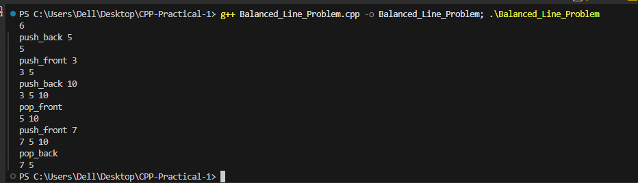

# Problem 5 --- Balanced Line Problem

### Problem Summary

In this task simulates a line of people using operations like
push_front, push_back, pop_front, and pop_back.

### Algorithm Explanation

1.  Use a deque to represent the line.\
2.  Perform operations based on user input.\
3.  After each operation, print the contents of the deque.

### Time Complexity

O(N) for N operations.

### Space Complexity

O(N) because the deque stores the elements in the line.

### Reflection

This problem helped me understand how deque works and how elements can
be inserted and removed from both ends efficiently.

