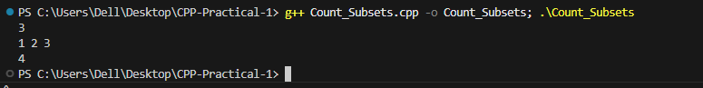

# Problem 9 --- Count Subsets with Even Sum

### Problem Summary

In this task counts how many subsets of a set have an even sum.

### Algorithm Explanation

1.  Generate all subsets using bitmasking.\
2.  Calculate the sum of each subset.\
3.  Check if the sum is even.\
4.  Count such subsets.

### Time Complexity

O(N × 2\^N)

### Space Complexity

O(N)

### Reflection

This problem helped me practice subset generation and how to analyze
properties like even or odd sums.

