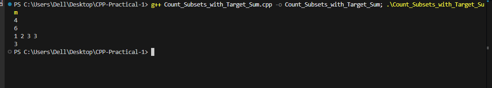

# Problem 10 --- Count Subsets with Target Sum

### Problem Summary

In this task counts the number of subsets whose sum equals a given
target value.

### Algorithm Explanation

1.  Generate all subsets using bitmasking.\
2.  Calculate the sum of each subset.\
3.  If the sum equals the target, increase the count.

### Time Complexity

O(N × 2\^N)

### Space Complexity

O(N)

### Reflection

This problem helped me understand how bitmasking can solve subset sum
problems and count valid subsets.

