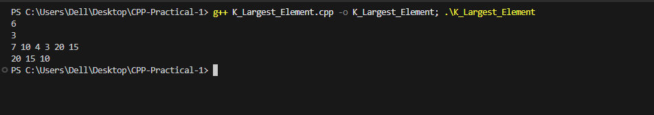

# Problem 6 --- K Largest Elements

### Problem Summary

In this task finds the K largest numbers from a list of N numbers.

### Algorithm Explanation

1.  Store all numbers in a max priority queue (max heap).\
2.  Extract the top element K times.\
3.  Print each extracted element.

### Time Complexity

O(N log N) because inserting elements into a heap takes log N time.

### Space Complexity

O(N) because the priority queue stores N elements.

### Reflection

This problem helped me learn how priority queues work and how heaps can
be used to quickly find the largest elements.

