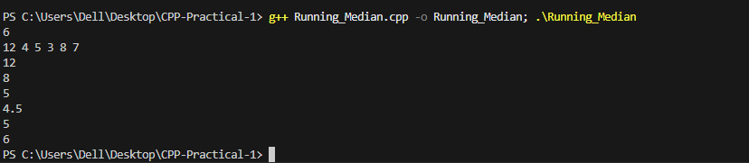

# Problem 7 --- Running Median

### Problem Summary

In this task calculates the median of numbers continuously as new
numbers are added.

### Algorithm Explanation

1.  Use two heaps:
    -   Max heap for smaller numbers\
    -   Min heap for larger numbers\
2.  Balance both heaps after each insertion.\
3.  Calculate median depending on heap sizes.

### Time Complexity

O(log N) per insertion.

### Space Complexity

O(N) because all numbers are stored in heaps.

### Reflection

This problem helped me understand how two heaps can be used to maintain
the median efficiently.

