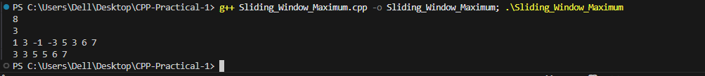

# Problem 4 --- Sliding Window Maximum

### Problem Summary

In this task finds the maximum element in every window of size K in an
array.

### Algorithm Explanation

1.  Use a deque to store useful indices.\
2.  Remove elements that are outside the current window.\
3.  Remove smaller elements that cannot be maximum.\
4.  The front of the deque always stores the maximum value index.

### Time Complexity

O(N) because each element is inserted and removed from the deque at most
once.

### Space Complexity

O(K) because the deque stores at most K elements.

### Reflection

This problem helped me understand how deque can optimize sliding window
problems. It reduced the brute force complexity from O(NK) to O(N).

