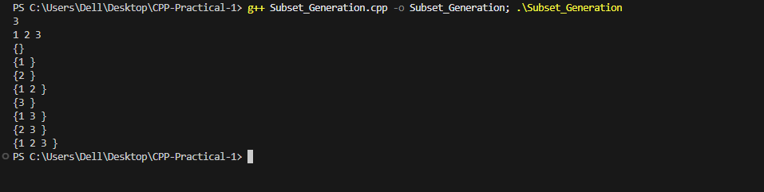

# Problem 8 --- Subset Generation

### Problem Summary

In this task prints all possible subsets of a given set of numbers.

### Algorithm Explanation

1.  Use bitmasking from `0` to `2^N - 1`.\
2.  Each bit represents whether an element is included in the subset.\
3.  Print elements corresponding to set bits.

### Time Complexity

O(N × 2\^N)

### Space Complexity

O(N)

### Reflection

This problem helped me understand bitmask techniques for generating all
subsets of a set.

