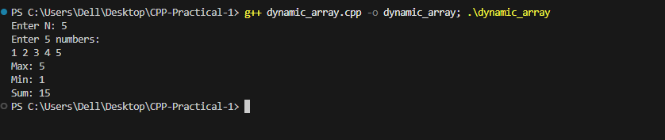

# Problem 1 --- Dynamic Array Basics

### Problem Summary

In this task reads N numbers and stores them in a vector. Then it finds
the maximum element, minimum element, and the sum of all elements in the
array.

### Algorithm Explanation

1.  Read the number of elements N.\
2.  Store the numbers in a vector.\
3.  Traverse the vector once.\
4.  While traversing, update the maximum, minimum, and sum values.

### Time Complexity

O(N) because we go through the array once.

### Space Complexity

O(N) because we store N elements in a vector.

### Reflection

This problem helped me understand how to use vectors as dynamic arrays
in C++. I learned how to store values and calculate basic statistics
like minimum, maximum, and sum.

