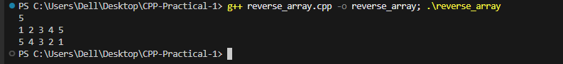

# Problem 2 --- Reverse the Array

### Problem Summary

In this taskreads N integers and prints them in reverse order.

### Algorithm Explanation

1.  Read the value of N.\
2.  Store the numbers in a vector.\
3.  Traverse the vector from the last element to the first.\
4.  Print each element.

### Time Complexity

O(N) because we print each element once.

### Space Complexity

O(N) because the vector stores N numbers.

### Reflection

This problem helped me practice reverse traversal of arrays. I learned
how to access vector elements from the end to the beginning.

