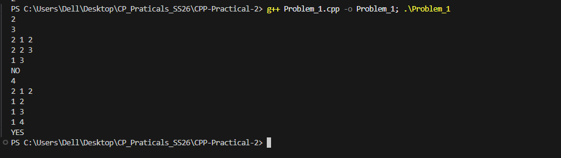

## Problem 1: Dinner Table Arrangements

### a. Problem Summary
We are given N friends with allergies. We need to arrange them in a circle such that no two adjacent friends share any common allergy.

### b. Algorithm Explanation
I converted each person's allergies into a bitmask. Then I generated all possible permutations of the friends. For each arrangement, I checked if adjacent people (including first and last) have no common allergy using bitwise AND.

### c. Time Complexity
O(N! × N) because we check all permutations and for each permutation we check N pairs.

### d. Space Complexity
O(N) for storing masks and permutations.

### e. Reflection
I learned how to use bitmasking to represent sets and how permutation can be used to check all arrangements. This problem helped me understand brute force with optimization.

