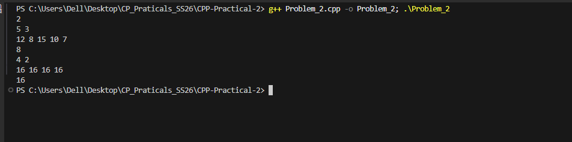

## Problem 2: Maximum AND Subarray

### a. Problem Summary
Given an array, we need to find the maximum possible AND value of any subarray of size K.

### b. Algorithm Explanation
I used a greedy bit approach. Starting from the highest bit, I tried to set each bit in the answer and checked if at least K numbers support that bit pattern.

### c. Time Complexity
O(32 × N) ≈ O(N), since we check 32 bits.

### d. Space Complexity
O(1), no extra space needed.

### e. Reflection
I learned how to solve problems using bitwise greedy techniques and how checking bits from MSB to LSB can help maximize values.

