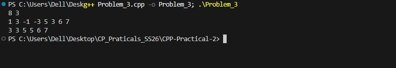

## Problem 3: Sliding Window Maximum

### a. Problem Summary
We need to find the maximum element in every subarray (window) of size K.

### b. Algorithm Explanation
I used a deque to store indices. I removed elements that are out of the window and also removed smaller elements from the back to maintain decreasing order.

### c. Time Complexity
O(N), since each element is added and removed at most once.

### d. Space Complexity
O(K), for the deque.

### e. Reflection
I learned how deque helps in optimizing sliding window problems efficiently instead of using brute force.

