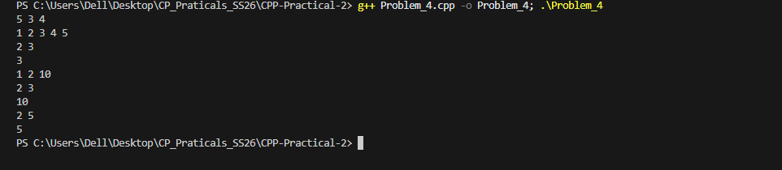

## Problem 4: Sliding Window with Updates

### a. Problem Summary
We need to process updates on an array and also answer queries for maximum in a sliding window.

### b. Algorithm Explanation
I used a segment tree to handle both updates and range maximum queries efficiently.

### c. Time Complexity
O(log N) per update and query.

### d. Space Complexity
O(4N) for the segment tree.

### e. Reflection
I learned how segment trees work and how they are useful when both updates and queries are needed.

