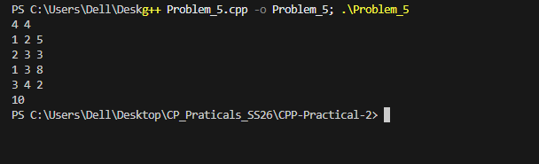

## Problem 5: Network Latency

### a. Problem Summary
We need to find the minimum time to travel from node 1 to node N in a weighted graph.

### b. Algorithm Explanation
I used Dijkstra’s algorithm with a priority queue to always pick the shortest distance node.

### c. Time Complexity
O((N + M) log N)

### d. Space Complexity
O(N + M) for graph storage.

### e. Reflection
I learned how shortest path algorithms work and how priority queues help optimize them.

