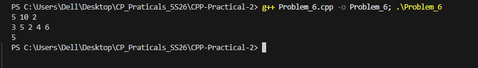

## Problem 6: Toll Booth Problem

### a. Problem Summary
We need to reach the last booth with minimum time using coins and limited skips.

### b. Algorithm Explanation
I used dynamic programming where state is position and number of skips used. I considered both options: pay or skip.

### c. Time Complexity
O(N × K)

### d. Space Complexity
O(N × K)

### e. Reflection
I learned how to model problems using DP with multiple states and make decisions based on constraints.

