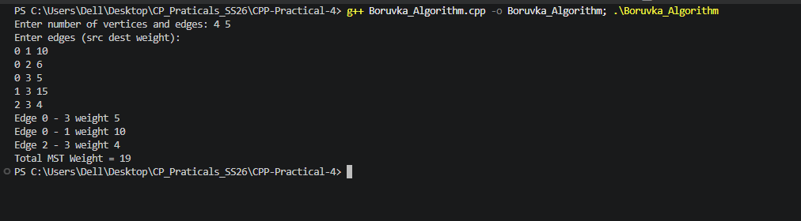

## 3. Boruvka's Algorithm

### Problem Summary
Boruvka's algorithm is used to find the **Minimum Spanning Tree (MST)** of a weighted graph. A Minimum Spanning Tree connects all vertices with the minimum possible total edge weight and without forming cycles.

### Algorithm Explanation
Initially, each vertex is treated as a separate component. The algorithm repeatedly performs the following steps:

1. Find the **cheapest edge** connected to each component.
2. Add those edges to the Minimum Spanning Tree.
3. Merge the connected components.

This process continues until all vertices become part of a single spanning tree.

### Time Complexity Analysis
During each iteration, edges are examined and components are merged.

**Time Complexity:**  
`O(E log V)`

Where:
- `V` = number of vertices  
- `E` = number of edges

### Space Complexity Analysis
The algorithm stores edges and parent arrays for components.

**Space Complexity:**  
`O(V + E)`

### Reflection
While implementing Borůvka's algorithm, I learned how Minimum Spanning Trees are built by repeatedly selecting the smallest edges connecting different components. It also helped me understand how components merge during the algorithm and how efficient edge selection helps minimize the total cost of the tree.
