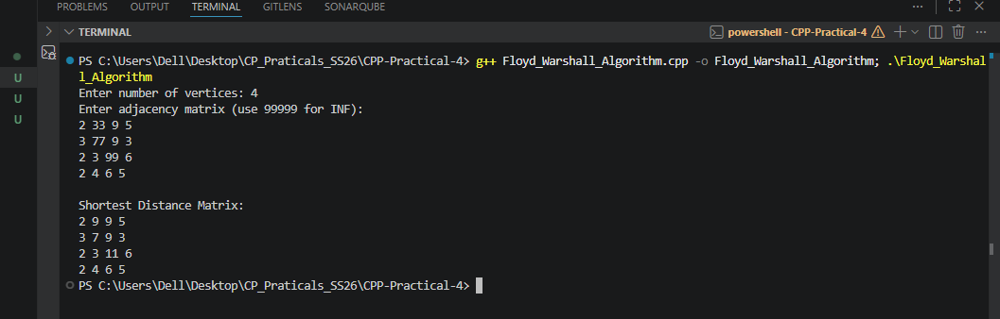

## 1. Floyd–Warshall Algorithm

### Problem Summary
The Floyd–Warshall algorithm is used to find the **shortest paths between all pairs of vertices** in a weighted graph. It works for both directed and undirected graphs and can handle negative edge weights, as long as there are no negative cycles.

### Algorithm Explanation
The algorithm uses a **dynamic programming approach**. It checks whether the shortest path between two vertices can be improved by passing through another intermediate vertex.

For every vertex `k`, the algorithm checks if the path from `i` to `j` through `k` is shorter than the current known path.

The update rule is:

dist[i][j] = min(dist[i][j], dist[i][k] + dist[k][j])

This process is repeated for all vertices until the shortest distance between every pair of vertices is found.

### Time Complexity Analysis
- The algorithm uses three nested loops over the vertices.
- Each loop runs `V` times.

**Time Complexity:**  
`O(V^3)`

Where `V` is the number of vertices.

### Space Complexity Analysis
The algorithm stores the distances in a matrix.

**Space Complexity:**  
`O(V^2)`

### Reflection
While implementing the Floyd–Warshall algorithm, I learned how dynamic programming can be applied to graph problems. I understood how intermediate vertices can help find shorter paths between nodes. The algorithm also helped me understand how shortest path problems can be solved for all vertex pairs efficiently.

