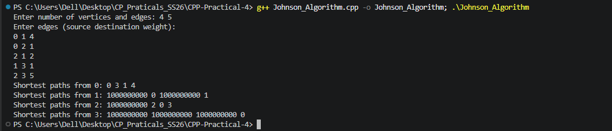

## 2. Johnson's Algorithm

### Problem Summary
Johnson's algorithm is used to compute the **shortest paths between all pairs of vertices in a sparse graph**. It supports graphs with negative edge weights but cannot work with negative weight cycles.

### Algorithm Explanation
Johnson's algorithm works by combining two algorithms:

1. **Bellman–Ford algorithm** is first used to detect negative cycles and calculate vertex weights.
2. The graph edges are **reweighted** so that all edge weights become non-negative.
3. After reweighting, **Dijkstra's algorithm** is run from each vertex to compute shortest paths.

This combination allows the algorithm to efficiently handle graphs with negative edges while maintaining good performance.

### Time Complexity Analysis

- Bellman–Ford: `O(VE)`
- Dijkstra (run for each vertex): `O(VE log V)`

**Overall Time Complexity:**  
`O(VE log V)`

Where:
- `V` = number of vertices  
- `E` = number of edges

### Space Complexity Analysis
The algorithm stores graph edges and distance arrays.

**Space Complexity:**  
`O(V + E)`

### Reflection
Through implementing Johnson's algorithm, I learned how multiple algorithms can work together to solve complex graph problems. It helped me understand the concept of edge reweighting and how Bellman–Ford and Dijkstra complement each other to compute shortest paths efficiently.

